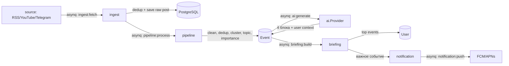

# Lumora — Архитектура

Этот документ фиксирует архитектуру проекта до начала кодирования этапов из `task.md`. Любое значимое архитектурное изменение должно сопровождаться обновлением этого файла (см. `task.md`, Этап 13).

---

## 1. Принцип

**Модульный монолит** с чистой (hexagonal-подобной) архитектурой внутри каждого домена.

Один репозиторий, один Go-модуль, два деплоймент-юнита (`cmd/api`, `cmd/worker`), общие внутренние пакеты. Границы между доменами такие же строгие, как между микросервисами (только через интерфейсы, без прямых импортов бизнес-логики друг друга) — это даёт:

- простую разработку и деплой на этапе MVP (одна команда `docker compose up`);
- возможность вынести любой домен (например, `ai` или `pipeline`) в отдельный сервис позже, без переписывания бизнес-логики — только замена вызова интерфейса на HTTP/grpc-клиент или новый producer/consumer очереди.

Правило зависимостей внутри домена:

```
transport/http  →  service  →  domain
                       ↑
                  repository (реализует интерфейсы из domain)
```

`domain` не импортирует ничего из `service`, `repository`, `transport` — только стандартная библиотека и типы самого домена. `service` зависит от интерфейсов, объявленных в `domain`, а не от конкретных реализаций `repository`.

Между доменами: никаких прямых импортов бизнес-логики. Общение — либо через интерфейс, который объявляет вызывающий домен (Dependency Inversion, реализацию подставляет `cmd/api|worker` при wiring), либо асинхронно через задачи в очереди (Redis/asynq).

Сборка зависимостей (DI) — вручную, в `main()` каждого бинарника. Без DI-фреймворков (wire/fx) — на масштабе MVP это добавляет сложность без выгоды; ручной wiring нагляднее и проще отлаживать.

---

## 2. Дерево каталогов

```
Lumora/
├── cmd/
│   ├── api/                    # HTTP REST API (Этап 11)
│   │   └── main.go
│   ├── worker/                 # asynq worker: ingest/pipeline/ai/briefing/notification
│   │   └── main.go
│   └── migrate/                 # тонкая обёртка над goose-библиотекой (без CLI со всеми драйверами)
│       └── main.go
├── internal/
│   ├── platform/                # сквозная инфраструктура, не бизнес-логика
│   │   ├── postgres/            # pgx pool, health-check
│   │   ├── redis/               # redis client
│   │   ├── queue/                # asynq client/server wiring, task type constants
│   │   ├── logger/               # log/slog setup (JSON handler)
│   │   ├── httpserver/           # chi router base, middleware, graceful shutdown, /healthz /readyz
│   │   └── jwtauth/              # выпуск/валидация JWT, middleware авторизации
│   ├── config/                   # чтение .env → строго типизированный Config
│   ├── auth/                     # Этап 2
│   ├── user/                     # Этап 3
│   ├── usercontext/               # Этап 4
│   ├── source/                    # Этап 5
│   ├── ingest/                    # Этап 6
│   ├── pipeline/                  # Этап 7
│   ├── ai/                        # Этап 8
│   ├── briefing/                  # Этап 9
│   ├── notification/              # Этап 10
│   └── apihttp/                   # Этап 11: корневой роутер, агрегирующий все transport/http
├── migrations/                    # goose SQL миграции (Up/Down), один общий список для всей БД
├── db/
│   └── schema.sql                 # кумулятивная схема (только CREATE) — источник типов для sqlc,
│                                   # обновляется в той же задаче, что и новая goose-миграция
├── deployments/
│   ├── Dockerfile
│   └── docker-compose.yml
├── docs/
│   ├── openapi.yaml                # Этап 11
│   └── architecture/               # диаграммы при необходимости
├── go.mod
├── Makefile
├── sqlc.yaml
└── .env.example
```

Каждый домен в `internal/<domain>/` имеет одинаковую внутреннюю структуру:

```
internal/<domain>/
├── domain/          # сущности, доменные ошибки, интерфейсы-порты (Repository, внешние зависимости)
├── service/          # бизнес-логика (use cases), реализует публичный API домена
├── repository/        # адаптер к Postgres: sqlc-запросы + реализация интерфейсов из domain
│   └── sqlc/
│       ├── queries/    # *.sql
│       └── gen/         # сгенерированный sqlc код (в git, не гитигнорится)
└── transport/
    └── http/            # handlers, DTO (request/response), регистрация роутов домена
```

Домены, не выставляющие HTTP наружу напрямую (`ingest`, `pipeline`, `ai`, `briefing`) вместо `transport/http` имеют `transport/worker/` — asynq task handlers.

---

## 3. Домены и соответствие этапам `task.md`

| Этап | Домен(ы) | Ответственность | Статус |
|---|---|---|---|
| 1. Инициализация | `internal/platform/*`, `internal/config`, `cmd/api`, `cmd/worker`, `deployments/` | БД, Redis, конфиг, логи, graceful shutdown, health-check | ✅ |
| 2. Авторизация | `internal/auth`, `internal/platform/jwtauth`, `internal/apihttp` | Регистрация, логин, JWT (access) + opaque refresh-токены с ротацией, logout, получение профиля (`/api/v1/auth/*`) | ✅ |
| 3. Пользователь | `internal/user` | Профиль: имя, страна, язык, профессия, интересы, темы | ✅ |
| 4. Контекст пользователя | `internal/usercontext` | Хранение/редактирование AI-контекста | ✅ |
| 5. Источники | `internal/source` | RSS/YouTube/Telegram, интерфейс `Fetcher` на тип источника | ✅ (CRUD + реализации `Fetcher` в `internal/source/fetcher`, добавлены Этапом 6) |
| 6. Импорт данных | `internal/ingest` | Получение публикаций, дедуп, подготовка текста (asynq: `ingest:fetch`) | ✅ |
| 7. Обработка событий | `internal/pipeline` | Очистка, дедуп, кластеризация, тема, важность (asynq: `pipeline:process`) | ✅ |
| 8. AI | `internal/ai` | Интерфейс `Provider`, 4 блока на событие с учётом контекста (asynq: `ai:generate`) | ✅ (провайдер — Anthropic Claude) |
| 9. Генерация брифинга | `internal/briefing` | Утренний/вечерний брифинг из важных событий (asynq: `briefing:build`) | ✅ |
| 10. Push-уведомления | `internal/notification` | Интерфейс `Sender` (FCM), только действительно важные события (asynq: `notification:push`) | ✅ |
| 11. Frontend API | `internal/apihttp` + `transport/http` каждого домена | REST API, OpenAPI-документация в `docs/openapi.yaml` | ✅ |
| 12. Тестирование | `*_test.go` рядом с кодом в каждом домене | Unit (testify) + Integration (testcontainers-go) | ✅ |
| 13. Документация | `README.md`, `ARCHITECTURE.md`, `docs/` | Обновляются после каждой завершённой задачи | текущее |

### Ключевые интерфейсы-порты (объявляются в `domain/`)

- `source.Fetcher` — `Fetch(ctx, Source) ([]RawPost, error)`; реализации в `internal/source/fetcher`: `RSSFetcher` (`gofeed`, покрывает `rss` и `youtube`), `TelegramFetcher` (скрейпинг `t.me/s/<channel>`).
- `ai.Provider` — `Explain(ctx, EventInput, userContext string) (ProviderResult, error)`; реализация — `internal/ai/provider.ClaudeProvider` (Anthropic Claude, `claude-opus-5`, согласовано с пользователем 2026-07-25); интерфейс не завязан на конкретного вендора.
- `notification.Sender` — `Send(ctx, PushMessage) error`; реализация — `internal/notification/provider.FCMSender` (Firebase Cloud Messaging HTTP v1 API).
- `auth.TokenIssuer` / `auth.Repository`, `user.Repository`, и т.д. — по одному репозиторий-порту на домен, реализация в `repository/`.

---

## 4. Поток данных пайплайна



PostgreSQL — источник истины для всех сущностей. Redis — только шина задач (asynq) и, при необходимости, кэш. Все переходы между стадиями пайплайна — асинхронные задачи в очереди, а не прямые вызовы функций между доменами: это даёт retry, независимое масштабирование воркеров и устойчивость к пиковым нагрузкам источников.

---

## 5. Технологический стек

| Область | Выбор | Обоснование |
|---|---|---|
| HTTP-роутинг | [`chi`](https://github.com/go-chi/chi) | Совместим с `net/http`, группировка роутов, готовые middleware (RequestID, Recoverer, Timeout) |
| Доступ к БД | `pgx/v5` + `sqlc` | Типобезопасный код из явного SQL, максимальная производительность, полный контроль над запросами на масштабе. sqlc берёт схему из `db/schema.sql` (только `CREATE`), а не из `migrations/`, — goose-файлы содержат `Up`+`Down` в одном файле, и `DROP` из `Down` ломает вывод типов sqlc, если направить его прямо на `migrations/` |
| Миграции | `goose` (как библиотека, через `cmd/migrate`) | Простые SQL-миграции с `up/down`. Используем `goose` как Go-библиотеку в собственном `cmd/migrate`, а не `goose/cmd/goose` CLI — у CLI зависимости на все поддерживаемые СУБД (ClickHouse, MSSQL, MySQL, YDB, Turso...), это лишний вес и точки отказа при `go run ...@latest` |
| Очереди/фоновые задачи | Redis + `hibiken/asynq` | Redis уже в стеке (Этап 1); retry/scheduling/worker pool без Kafka-инфраструктуры на старте |
| Конфигурация | `godotenv` + `caarlos0/env` | `.env` → строго типизированная структура `Config`, минимум ручного парсинга |
| Логирование | `log/slog` (stdlib) | Структурные JSON-логи без лишней зависимости |
| JWT | `golang-jwt/jwt/v5` | Стандарт де-факто для JWT в Go |
| Unit-тесты | `testing` + `testify` | Ассершены/моки только для внешних портов (AI-провайдер, Fetcher, Sender) |
| Integration-тесты | `testcontainers-go` | Тесты репозиториев и очередей — против настоящих Postgres/Redis, без моков БД |
| Парсинг RSS/Atom | `mmcdole/gofeed` | Один парсер закрывает и `rss`, и `youtube` — публичный Atom-фид канала YouTube (`youtube.com/feeds/videos.xml?channel_id=...`) имеет тот же формат |
| Парсинг HTML (Telegram) | `PuerkitoBio/goquery` | Скрейпинг публичной `t.me/s/<channel>` (Этап 6) — jQuery-подобный API поверх `golang.org/x/net/html`, стандартный выбор для разбора HTML в Go |
| AI-провайдер | `anthropics/anthropic-sdk-go`, модель `claude-opus-5` | Согласовано с пользователем 2026-07-25 (Этап 8). Структурированный вывод (`output_config.format` с JSON Schema) вместо assistant prefill — prefill не поддерживается на этой модели |
| Push-провайдер | FCM HTTP v1 API + `golang.org/x/oauth2/google` | Согласовано с пользователем 2026-07-25 (Этап 10). Один API покрывает и Android, и iOS (оба типа устройств получают push через FCM). Прямой HTTP-вызов с OAuth2-токеном сервисного аккаунта вместо `firebase-admin-go` — из всего Admin SDK нужен только этот вызов, тянуть весь SDK лишнее |

---

## 6. Конвенции

- Каждый новый домен — независимый пакет с интерфейсами-портами, без прямых импортов бизнес-логики других доменов.
- Комментарии — только там, где неочевидна причина решения (не что делает код, а почему).
- Миграции — по одной директории `migrations/` на весь проект, имена таблиц без домен-префиксов (`users`, `sources`, `events`, ...).
- Каждый асинхронный переход пайплайна — отдельный тип задачи asynq с константой в `internal/platform/queue`.
- REST API документируется в `docs/openapi.yaml`; при добавлении/изменении эндпоинта — обновляется в той же задаче.
- После завершения каждого этапа — обновляется `README.md` и, если менялась структура, этот файл.

---

## 7. Следующий шаг

Этапы 1 (инициализация), 2 (авторизация), 3 (профиль пользователя), 4 (контекст пользователя), 5 (источники), 6 (импорт данных), 7 (обработка событий), 8 (AI), 9 (генерация брифинга) и 10 (push-уведомления) реализованы по одинаковой слоистой структуре домена. Этап 2 провалидирован end-to-end через `docker compose` (register/login/refresh-ротация/logout/me).

`internal/user` хранит профиль в таблице `user_profiles` (1:1 к `users`, `ON DELETE CASCADE`). `GET /api/v1/user/profile` создаёт пустой профиль при первом обращении (`GetOrCreateProfile`), `PUT` — полная замена (`UpsertProfile`); оба запроса — upsert через `ON CONFLICT (user_id) DO UPDATE`, чтобы не требовать отдельного шага создания профиля при регистрации и не связывать домены `auth`/`user` напрямую.

`internal/usercontext` — тот же паттерн, но с одним полем `content` (свободный текст до 4000 символов) в таблице `user_context`: `GET /api/v1/context` возвращает/создаёт пустой контекст, `PUT /api/v1/context` заменяет его целиком. Этот контекст — вход для `ai.Provider` (Этап 8) при генерации объяснений событий; домены `ai`/`briefing` будут читать его через порт `usercontext`-репозитория, а не напрямую из БД.

`internal/source` — управление источниками пользователя (таблица `sources`: `user_id`, `type` с `CHECK (type IN ('rss','youtube','telegram'))`, `name`, `url`, `enabled`). CRUD: `POST/GET/PATCH/DELETE /api/v1/sources`. Порт `domain.Fetcher` и его реализации (`internal/source/fetcher`) добавлены Этапом 6 — см. ниже.

`internal/ingest` (Этап 6) — импорт публикаций:
- **Fetcher-реализации** в `internal/source/fetcher`: `RSSFetcher` (`gofeed.ParseURLWithContext`, покрывает и `rss`, и `youtube` — публичный Atom-фид канала YouTube тот же формат) и `TelegramFetcher` (скрейпинг публичной `t.me/s/<channel>` через `goquery`, без Bot API — согласовано с пользователем 2026-07-25: Bot API отброшен, так как требует добавления бота админом в каждый канал, что не подходит для произвольных публичных каналов; известный риск скрейпинга — зависимость от вёрстки Telegram, вне официального ToS). `Registry.For(Type)` выбирает нужный `Fetcher`.
- **`internal/ingest/domain.Post`** — импортированная публикация, таблица `posts` (`source_id`, `external_id`, `UNIQUE(source_id, external_id)` — дедупликация на уровне БД через `ON CONFLICT ... DO NOTHING RETURNING`, дубли молча пропускаются в `repository.SaveNewPosts`).
- **`ingest.Service.ImportSource(ctx, sourceID)`** — получает источник через `SourceRepository.GetSourceByID` (без `userID`: это системный вызов из воркера, не из авторизованного HTTP-запроса; отдельный узкий порт, объявленный в `ingest/service`, а не прямой импорт `source/service`), пропускает выключенные источники, готовит текст (`prepareText`: снимает HTML-теги, декодирует сущности, схлопывает пробелы) и сохраняет новые публикации.
- **Триггер** — asynq-задача `queue.TypeIngestFetch` (`ingest:fetch`, payload `{"source_id": "..."}`), обработчик зарегистрирован в `cmd/worker/main.go`. **Осознанное сужение объёма** (согласовано с пользователем 2026-07-25): реализован только механизм импорта по задаче; автоматического периодического опроса источников (scheduler/cron, который сам ставит `ingest:fetch` для всех enabled-источников) нет — задачи нужно ставить в очередь вручную (например, через `asynqmon` или скрипт). Добавить планировщик — по мере необходимости, отдельной небольшой задачей, не обязательно привязанной к следующему этапу.
- После успешного импорта `ingestworker.Handler` сам ставит `queue.TypePipelineProcess` (`pipeline:process`, payload `{"post_ids": [...]}`) для только что сохранённых публикаций — это уже не «автозапуск опроса источников» (тот шаг остался ручным), а штатная передача между стадиями одного и того же прогона пайплайна, как и показано на диаграмме в §4. Ошибка постановки `pipeline:process` не проваливает `ingest:fetch` — импорт уже durable в БД, обработку можно поставить в очередь позже вручную.

`internal/pipeline` (Этап 7) — кластеризация публикаций в события, без ML/embeddings (это резерв Этапа 8, где появляется `ai.Provider`):
- **Сходство** (`internal/pipeline/service/textmatch.go`): токенизация (нижний регистр, буквенно-цифровые последовательности от 3 символов, без стоп-слов/стемминга) + коэффициент Жаккара по множеству токенов заголовка+текста. Порог `similarityThreshold = 0.3` и окно `clusterWindow = 48h` — именованные MVP-константы в `service.go`, кандидаты на пересмотр по метрикам, а не проектные инварианты.
- **Дедупликация и кластеризация — один и тот же проход**: `Service.Process(ctx, postIDs)` для каждой публикации ищет наиболее похожее событие среди (а) недавних событий из БД (`last_seen_at >= now-48h`) и (б) событий, уже созданных в рамках текущего батча — второе даёт кластеризацию и внутри одного вызова, без похода в БД между публикациями. При сходстве ≥ порога публикация присоединяется (`Repository.AttachPost`), иначе создаёт новое событие (`Repository.CreateEventWithPost`). Обе операции — по одной SQL-транзакции (`pgxpool.Pool.Begin` + `sqlcgen.Queries.WithTx`), чтобы не оставить событие без привязанной публикации при сбое между двумя запросами.
- **Тема**: `internal/pipeline/service/topic.go` — таксономия `ai/economy/crypto/world/other` (см. пример брифинга в README), назначается по совпадению ключевых слов с границами слов (`\bслово\b`, чтобы не словить "war" внутри "award") один раз при создании события, не пересматривается при присоединении новых публикаций. Явный плейсхолдер: правило-based, а не AI-driven — переоценить по мере необходимости, не обязательно в Этапе 8.
- **Важность**: чисто эвристическая — `importance = LEAST(100, source_count * 20)`, где `source_count` — число различных `sources.id`, публикации которых присоединены к событию (пересчитывается в SQL через `COUNT(DISTINCT source_id)` при каждом присоединении, `internal/pipeline/repository/sqlc/queries/events.sql`). Смысл: чем больше независимых источников подтвердили одно и то же событие, тем оно важнее. Это отдельная метрика от AI-объяснения «почему это важно» (Этап 8) — используется брифингом (Этап 9) и уведомлениями (Этап 10) для отбора топ-событий.
- Домен без HTTP: как `ingest`, только `transport/worker` — обработчик `queue.TypePipelineProcess` зарегистрирован в `cmd/worker/main.go`.

`internal/ai` (Этап 8) — персонализированное AI-объяснение события:
- **Ключевое архитектурное решение**: объяснение генерируется на пару **(event, user)**, не на одно событие глобально. Причина — четвёртый блок, «что это значит лично для пользователя», зависит от контекста конкретного пользователя (Этап 4), поэтому одно и то же событие для разных пользователей может получить разные объяснения. Таблица `event_explanations`: `UNIQUE(event_id, user_id)`, upsert при повторной генерации.
- **Провайдер** (согласовано с пользователем 2026-07-25): Anthropic Claude, модель `claude-opus-5`, через `anthropics/anthropic-sdk-go`. Ключ — `ANTHROPIC_API_KEY`, читается SDK напрямую из окружения (не через `internal/config`, так как нужен только `cmd/worker`, а не `cmd/api`). Вывод — структурированный JSON (`output_config.format` с JSON Schema на 4 строковых поля) вместо assistant prefill: prefill не поддерживается на `claude-opus-5` (см. skill `claude-api`), а structured outputs — его официальная замена, с той же гарантией валидного формата без парсинга произвольного текста. `stop_reason: "refusal"` (safety-классификаторы) обрабатывается явно, а не падением при чтении `content`.
- **`ai.Service.GenerateExplanation(ctx, eventID, userID)`** — читает событие через узкий `EventRepository` (заглушка над `pipeline.Repository.GetEventByID`, добавленным этим этапом) и контекст пользователя через узкий `UserContextRepository` (заглушка над `usercontext.Repository.GetContext`) — оба порта объявлены в `ai/service`, а не прямым импортом чужих `service`/`repository`, тот же паттерн, что и в `ingest`/`pipeline`. Передаёт `event.Title + event.MatchText` (тот же агрегированный текст, что использует кластеризация) и `userContext.Content` в `Provider.Explain`, сохраняет результат.
- **Осознанная граница объёма**: `GenerateExplanation` не решает, **каким пользователям какие события интересны** — это подбирает Этап 9 (брифинг), который и будет ставить задачи `ai:generate` с конкретными парами `(event_id, user_id)`. Этап 8 — только механизм генерации для уже выбранной пары. Это не сужение по договорённости с пользователем (как было с Telegram/планировщиком), а логическая необходимость: до появления Этапа 9 нет источника данных о том, какие события релевантны какому пользователю.
- Триггер — asynq-задача `queue.TypeAIGenerate` (`ai:generate`, payload `{"event_id": "...", "user_id": "..."}`), обработчик зарегистрирован в `cmd/worker/main.go`. Автоматически её теперь ставит Этап 9 (`briefing.Service.Build`, напрямую в процессе — не через отдельный отложенный `ai:generate`, см. ниже).

`internal/briefing` (Этап 9) — сборка утреннего/вечернего брифинга:
- **Релевантность события пользователю — по его источникам** (согласовано с пользователем 2026-07-25): событие релевантно, если хотя бы одна из его публикаций (`posts.event_id`) пришла из источника, принадлежащего этому пользователю (`sources.user_id`). Тематический матчинг по `user_profiles.interests/topics` — не в этом этапе (профильные поля сейчас свободный текст без строгой таксономии, годится для fuzzy-match, который не входит в MVP).
- **Дедупликация между брифингами**: `ListCandidateEvents` явно исключает события, уже включённые в любой предыдущий брифинг этого пользователя (`NOT EXISTS` по `briefing_events` через `briefings.user_id`) — одно и то же событие не попадёт в брифинг дважды. Плюс окно `since = now - 12h`, совпадающее с интервалом между утренним и вечерним запуском планировщика.
- **`Service.Build(ctx, userID, type)`**: получает до 10 кандидатов, отсортированных по важности (Этап 7); для каждого — объяснение (Этап 8) через `GetExplanation` (без повторного AI-вызова, если уже сгенерировано) или `GenerateExplanation` (если нет — **это и есть фактический триггер `ai:generate`**, вызывается напрямую как Go-метод в процессе воркера, а не через отдельную постановку задачи в очередь и ожидание). События, для которых генерация не удалась, пропускаются (не проваливают весь брифинг). Если после этого не осталось ни одного события — `domain.ErrNoRelevantEvents`: не ошибка обработки, а нормальное состояние («слать нечего»), asynq-обработчик логирует и возвращает `nil`, не проваливая задачу.
- **Хранение**: `briefings` (`id`, `user_id`, `type` CHECK `IN ('morning','evening')`, `generated_at`) + `briefing_events` (`briefing_id`, `event_id`, `rank`) — join-таблица, порядок = важность. Текст объяснения не дублируется — при необходимости читается из `event_explanations` по `(event_id, user_id)`. Создание брифинга и привязка событий — одна транзакция (`pgx.Tx` + `WithTx`, тот же паттерн, что в `pipeline`).
- **Автопланировщик — включён сразу** (согласовано с пользователем 2026-07-25, в отличие от отложенного планировщика Этапа 6): `asynq.Scheduler` (часовой пояс — **UTC**, без учёта часового пояса конкретного пользователя — MVP-упрощение) с двумя cron-записями в `cmd/worker/main.go`: `"0 8 * * *"` → `briefing:dispatch{type:"morning"}`, `"0 20 * * *"` → `briefing:dispatch{type:"evening"}`. `briefingworker.DispatchHandler` по каждой из них находит всех пользователей хотя бы с одним источником (`ListActiveUserIDs`, без источников брифинг всё равно вернёт `ErrNoRelevantEvents`) и ставит `briefing:build` для каждого — фан-аут для всех пользователей, а не общая задача.
- **Известное ограничение**: `asynq.Scheduler` в текущей схеме работает в том же процессе `cmd/worker`, что и обработчик задач. При масштабировании `cmd/worker` до нескольких реплик планировщик задвоится (каждая реплика будет ставить `briefing:dispatch` по своему расписанию) — на масштабе MVP (один процесс) это не проблема; при горизонтальном масштабировании воркера планировщик нужно будет вынести в отдельный процесс/реплику с лидер-election или отдельный `cmd/scheduler`.
- Домен без HTTP: как `ingest`/`pipeline`/`ai`, только `transport/worker`.

`internal/notification` (Этап 10) — регистрация устройств и push-уведомления:
- **Хранение токенов**: `device_tokens` (`user_id`, `platform`, `token UNIQUE`). `RegisterDevice` — upsert по токену (`ON CONFLICT (token) DO UPDATE`), тот же приём, что и в других доменах: переустановка приложения или смена аккаунта на одном устройстве переносит токен на нового владельца, а не плодит дубли.
- **`notification.Service.RegisterDevice/RemoveDeviceToken`** (`internal/notification/service`) — HTTP-уровень (`POST/DELETE /api/v1/notifications/devices`). `RemoveDeviceToken` проверяет, что удаляемый токен принадлежит вызывающему пользователю (сверка со списком его же токенов), прежде чем удалить — иначе один пользователь мог бы удалить чужой токен по угаданному значению.
- **`notification.Service.NotifyEvent(ctx, userID, PushMessage)`** — отправляет на все зарегистрированные устройства пользователя через порт `domain.Sender`. Ошибка отправки на одно устройство не проваливает остальные (логируется и пропускается); если `Sender` возвращает `domain.ErrInvalidToken` (устройство больше не существует), токен удаляется из хранилища. Нет ни одного устройства — `domain.ErrNoDeviceTokens`, тот же паттерн «нормальное состояние, не ошибка», что и `briefing.ErrNoRelevantEvents`.
- **Провайдер** (согласовано с пользователем 2026-07-25): Firebase Cloud Messaging, HTTP v1 API напрямую (`internal/notification/provider.FCMSender`) — без `firebase-admin-go`, из всего Admin SDK нужен только OAuth2-токен сервисного аккаунта (`golang.org/x/oauth2/google`) и один HTTP POST. Учётные данные (`FCM_PROJECT_ID`, `FCM_CREDENTIALS_FILE`) читаются напрямую из окружения и **лениво** — при первом реальном `Send`, а не в конструкторе, — чтобы отсутствие FCM-настроек не мешало `cmd/worker` запускаться одной командой (task.md, Этап 1); без них падает только конкретная задача `notification:push`, не весь процесс. FCM отвечает 404 или телом с `UNREGISTERED` для несуществующих токенов — это транслируется в `domain.ErrInvalidToken`.
- **Триггер**: не постановка `notification:push` из HTTP, а `briefingworker.Handler.HandleBuild` (`internal/briefing/transport/worker`) — после успешного `briefing:build` перебирает события собранного брифинга и ставит `queue.TypeNotificationPush` для тех, чья важность (Этап 7) ≥ `pushImportanceThreshold = 60` (эквивалент 3+ независимых источников). Порог — именованная MVP-константа в `briefingworker`, кандидат на пересмотр по метрикам, тот же статус, что и `similarityThreshold` в `pipeline`. Решение оставить постановку задачи в transport-слое `briefing`, а не сделать `notification` прямой зависимостью `briefing/service`, — по прямой рекомендации из этого же документа (§4): переход между стадиями пайплайна — асинхронная задача в очереди, а не прямой вызов чужого домена.
- Ошибка постановки `notification:push` логируется и не проваливает `briefing:build` — брифинг уже сохранён, push можно поставить в очередь позже вручную (тот же принцип, что у `ingestworker.Handler` для `pipeline:process`).
- HTTP (`transport/http`) для управления устройствами + `transport/worker` для `notification:push` — единственный домен пайплайна с обоими видами транспорта одновременно.

Этап 11 (Frontend API) — сам REST API уже собран `internal/apihttp` из `transport/http` доменов `auth`/`user`/`usercontext`/`source`/`notification` по мере их реализации (Этапы 2-10); Этап 11 добавляет только недостающую часть — документацию:
- **`docs/openapi.yaml`** — OpenAPI 3.0, вручную (без автогенерации из кода: доменов пять, эндпоинтов меньше двадцати — генератор не окупается на этом масштабе). У каждого эндпоинта — `description`, пример запроса и пример(ы) ответа на каждый статус-код, включая ошибки (`400`/`401`/`404`/`409`/`503`), и общая security-схема `bearerAuth` (JWT), проставленная per-operation (`security: []` у публичных `/auth/register`, `/auth/login`, `/auth/refresh`, `/auth/logout`, `/healthz`, `/readyz`).
- `/healthz`/`/readyz` (Этап 1) включены в спецификацию, хотя формально не под `/api/v1` — они часть публичной HTTP-поверхности, которую видит фронтенд/инфраструктура.
- Валидация — `openapi-spec-validator` (Python), не встроена в `make test`/CI (нет combo Python+Go раннера в этом проекте) — прогонять вручную при правке спеки: `pip install openapi-spec-validator && python3 -c "from openapi_spec_validator import validate_spec; from openapi_spec_validator.readers import read_from_filename; validate_spec(read_from_filename('docs/openapi.yaml')[0])"`.
- Спецификация не раздаётся HTTP-эндпоинтом (например, `/api/v1/openapi.yaml` или Swagger UI) — сознательно вне объёма этапа: файл в репозитории уже решает задачу «REST API документирован», а раздача спеки — отдельная, самостоятельная фича, которую можно добавить позже без изменения самой спецификации.

Этап 12 (Тестирование) — до этого этапа каждый домен уже получал unit-тесты сервиса (`service/*_test.go`, fake-репозитории в памяти) и integration-тесты репозитория (`repository/postgres_test.go`, тег `integration`, `testcontainers-go` — реальный Postgres, без моков БД) в рамках своего же этапа (2-10); Этап 12 закрывает единственный оставшийся пробел — **транспортный слой** (`transport/http`, `transport/worker`) и часть `platform`, у которых до этого не было ни одного теста:
- **`internal/platform/jwtauth`** — самый чувствительный к безопасности пакет проекта (подпись/валидация access-JWT) не имел покрытия вообще. Добавлены: round-trip выпуска/валидации, отклонение просроченного токена, отклонение токена с чужим секретом, отклонение `alg: none` (классическая атака "alg confusion" на JWT-библиотеки, не специфичная для этого проекта, но обязательная к проверке для любой JWT-валидации), поведение `Middleware` на отсутствующий/некорректный/невалидный заголовок.
- **`internal/platform/queue`** — round-trip маршалинга для всех `NewXxxTask`-конструкторов (тип задачи + payload).
- **`transport/http`** (`auth`, `user`, `usercontext`, `source`, `notification`) — тесты поднимают реальный `chi`-роутер через `RegisterRoutes` и настоящий `jwtauth.Issuer.Middleware` (не заглушку) поверх `service.New(fakeRepository, ...)` с in-memory фейком репозитория конкретного домена (тот же паттерн fake-репозиториев, что и в существующих unit-тестах сервисов, только заново объявленный в пакете `transport/http`, так как это отдельный test-package). Проверяются: успешные пути, коды ошибок домена → HTTP-статус (400/401/404/409), отсутствие/невалидность bearer-токена, для `source`/`notification` — что чужие данные (источник или device-токен другого пользователя) не видны и не редактируются вызывающим.
- **`transport/worker`** (`ingest`, `pipeline`, `ai`, `briefing`, `notification`) — тесты вызывают `Handle*(ctx, *asynq.Task)` напрямую (без реального Redis/asynq-сервера) с fake-репозиториями/провайдерами и fake `TaskEnqueuer` (перехватывает `Enqueue`, не пишет в очередь). Проверяются: невалидный payload → ошибка; «нормальные» sentinel-ошибки домена (`briefing.ErrNoRelevantEvents`, `notification.ErrNoDeviceTokens`) → `nil`, а не провал задачи; ошибка постановки следующей задачи в очереди не проваливает текущий обработчик (`ingest:fetch`→`pipeline:process`, `briefing:build`→`notification:push`, `briefing:dispatch`→`briefing:build`); `briefingworker.Handler` дополнительно проверен на то, что push ставится только для событий с importance ≥ `pushImportanceThreshold`.
- Полный набор (`go test ./...` и `go test -race ./...`) проходит без интеграционных (Docker недоступен в части окружений — см. `//go:build integration`).
