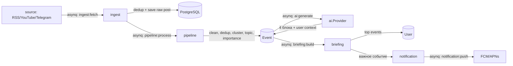

# Lumora — Архитектура

Этот документ фиксирует архитектуру проекта до начала кодирования этапов из `task.md`. Любое значимое архитектурное изменение должно сопровождаться обновлением этого файла (см. `task.md`, Этап 13).

---

## 1. Принцип

**Модульный монолит** с чистой (hexagonal-подобной) архитектурой внутри каждого домена.

Один репозиторий, один Go-модуль, два деплоймент-юнита (`cmd/api`, `cmd/worker`), общие внутренние пакеты. Границы между доменами такие же строгие, как между микросервисами (только через интерфейсы, без прямых импортов бизнес-логики друг друга) — это даёт:

- простую разработку и деплой на этапе MVP (одна команда `docker compose up`);
- возможность вынести любой домен (например, `ai` или `pipeline`) в отдельный сервис позже, без переписывания бизнес-логики — только замена вызова интерфейса на HTTP/grpc-клиент или новый producer/consumer очереди.

Правило зависимостей внутри домена:

```
transport/http  →  service  →  domain
                       ↑
                  repository (реализует интерфейсы из domain)
```

`domain` не импортирует ничего из `service`, `repository`, `transport` — только стандартная библиотека и типы самого домена. `service` зависит от интерфейсов, объявленных в `domain`, а не от конкретных реализаций `repository`.

Между доменами: никаких прямых импортов бизнес-логики. Общение — либо через интерфейс, который объявляет вызывающий домен (Dependency Inversion, реализацию подставляет `cmd/api|worker` при wiring), либо асинхронно через задачи в очереди (Redis/asynq).

Сборка зависимостей (DI) — вручную, в `main()` каждого бинарника. Без DI-фреймворков (wire/fx) — на масштабе MVP это добавляет сложность без выгоды; ручной wiring нагляднее и проще отлаживать.

---

## 2. Дерево каталогов

```
Lumora/
├── cmd/
│   ├── api/                    # HTTP REST API (Этап 11)
│   │   └── main.go
│   ├── worker/                 # asynq worker: ingest/pipeline/ai/briefing/notification
│   │   └── main.go
│   └── migrate/                 # тонкая обёртка над goose-библиотекой (без CLI со всеми драйверами)
│       └── main.go
├── internal/
│   ├── platform/                # сквозная инфраструктура, не бизнес-логика
│   │   ├── postgres/            # pgx pool, health-check
│   │   ├── redis/               # redis client
│   │   ├── queue/                # asynq client/server wiring, task type constants
│   │   ├── logger/               # log/slog setup (JSON handler)
│   │   ├── httpserver/           # chi router base, middleware, graceful shutdown, /healthz /readyz
│   │   └── jwtauth/              # выпуск/валидация JWT, middleware авторизации
│   ├── config/                   # чтение .env → строго типизированный Config
│   ├── auth/                     # Этап 2
│   ├── user/                     # Этап 3
│   ├── usercontext/               # Этап 4
│   ├── source/                    # Этап 5
│   ├── ingest/                    # Этап 6
│   ├── pipeline/                  # Этап 7
│   ├── ai/                        # Этап 8
│   ├── briefing/                  # Этап 9
│   ├── notification/              # Этап 10
│   └── apihttp/                   # Этап 11: корневой роутер, агрегирующий все transport/http
├── migrations/                    # goose SQL миграции (Up/Down), один общий список для всей БД
├── db/
│   └── schema.sql                 # кумулятивная схема (только CREATE) — источник типов для sqlc,
│                                   # обновляется в той же задаче, что и новая goose-миграция
├── deployments/
│   ├── Dockerfile
│   └── docker-compose.yml
├── docs/
│   ├── openapi.yaml                # Этап 11
│   └── architecture/               # диаграммы при необходимости
├── go.mod
├── Makefile
├── sqlc.yaml
└── .env.example
```

Каждый домен в `internal/<domain>/` имеет одинаковую внутреннюю структуру:

```
internal/<domain>/
├── domain/          # сущности, доменные ошибки, интерфейсы-порты (Repository, внешние зависимости)
├── service/          # бизнес-логика (use cases), реализует публичный API домена
├── repository/        # адаптер к Postgres: sqlc-запросы + реализация интерфейсов из domain
│   └── sqlc/
│       ├── queries/    # *.sql
│       └── gen/         # сгенерированный sqlc код (в git, не гитигнорится)
└── transport/
    └── http/            # handlers, DTO (request/response), регистрация роутов домена
```

Домены, не выставляющие HTTP наружу напрямую (`ingest`, `pipeline`, `ai`, `briefing`) вместо `transport/http` имеют `transport/worker/` — asynq task handlers.

---

## 3. Домены и соответствие этапам `task.md`

| Этап | Домен(ы) | Ответственность | Статус |
|---|---|---|---|
| 1. Инициализация | `internal/platform/*`, `internal/config`, `cmd/api`, `cmd/worker`, `deployments/` | БД, Redis, конфиг, логи, graceful shutdown, health-check | ✅ |
| 2. Авторизация | `internal/auth`, `internal/platform/jwtauth`, `internal/apihttp` | Регистрация, логин, JWT (access) + opaque refresh-токены с ротацией, logout, получение профиля (`/api/v1/auth/*`) | ✅ |
| 3. Пользователь | `internal/user` | Профиль: имя, страна, язык, профессия, интересы, темы | ✅ |
| 4. Контекст пользователя | `internal/usercontext` | Хранение/редактирование AI-контекста | ✅ |
| 5. Источники | `internal/source` | RSS/YouTube/Telegram, интерфейс `Fetcher` на тип источника | ✅ (CRUD; реализации `Fetcher` — Этап 6) |
| 6. Импорт данных | `internal/ingest` | Получение публикаций, дедуп, подготовка текста (asynq: `ingest:fetch`) | — |
| 7. Обработка событий | `internal/pipeline` | Очистка, дедуп, кластеризация, тема, важность (asynq: `pipeline:process`) | — |
| 8. AI | `internal/ai` | Интерфейс `Provider`, 4 блока на событие с учётом контекста (asynq: `ai:generate`) | — |
| 9. Генерация брифинга | `internal/briefing` | Утренний/вечерний брифинг из важных событий (asynq: `briefing:build`) | — |
| 10. Push-уведомления | `internal/notification` | Интерфейс `Sender` (FCM/APNs), только действительно важные события (asynq: `notification:push`) | — |
| 11. Frontend API | `internal/apihttp` + `transport/http` каждого домена | REST API, OpenAPI-документация в `docs/openapi.yaml` | частично (auth, user, usercontext, source смонтированы, OpenAPI не оформлен) |
| 12. Тестирование | `*_test.go` рядом с кодом в каждом домене | Unit (testify) + Integration (testcontainers-go) | частично (auth, user, usercontext, source) |
| 13. Документация | `README.md`, `ARCHITECTURE.md`, `docs/` | Обновляются после каждой завершённой задачи | текущее |

### Ключевые интерфейсы-порты (объявляются в `domain/`)

- `source.Fetcher` — `Fetch(ctx) ([]RawPost, error)`; реализации: RSS, YouTube, Telegram.
- `ai.Provider` — `Explain(ctx, Event, UserContext) (EventExplanation, error)`; реализация подключается позже (Claude/OpenAI — решение отложено, интерфейс не завязан на конкретного вендора).
- `notification.Sender` — `Send(ctx, PushMessage) error`; реализации: FCM, APNs.
- `auth.TokenIssuer` / `auth.Repository`, `user.Repository`, и т.д. — по одному репозиторий-порту на домен, реализация в `repository/`.

---

## 4. Поток данных пайплайна



PostgreSQL — источник истины для всех сущностей. Redis — только шина задач (asynq) и, при необходимости, кэш. Все переходы между стадиями пайплайна — асинхронные задачи в очереди, а не прямые вызовы функций между доменами: это даёт retry, независимое масштабирование воркеров и устойчивость к пиковым нагрузкам источников.

---

## 5. Технологический стек

| Область | Выбор | Обоснование |
|---|---|---|
| HTTP-роутинг | [`chi`](https://github.com/go-chi/chi) | Совместим с `net/http`, группировка роутов, готовые middleware (RequestID, Recoverer, Timeout) |
| Доступ к БД | `pgx/v5` + `sqlc` | Типобезопасный код из явного SQL, максимальная производительность, полный контроль над запросами на масштабе. sqlc берёт схему из `db/schema.sql` (только `CREATE`), а не из `migrations/`, — goose-файлы содержат `Up`+`Down` в одном файле, и `DROP` из `Down` ломает вывод типов sqlc, если направить его прямо на `migrations/` |
| Миграции | `goose` (как библиотека, через `cmd/migrate`) | Простые SQL-миграции с `up/down`. Используем `goose` как Go-библиотеку в собственном `cmd/migrate`, а не `goose/cmd/goose` CLI — у CLI зависимости на все поддерживаемые СУБД (ClickHouse, MSSQL, MySQL, YDB, Turso...), это лишний вес и точки отказа при `go run ...@latest` |
| Очереди/фоновые задачи | Redis + `hibiken/asynq` | Redis уже в стеке (Этап 1); retry/scheduling/worker pool без Kafka-инфраструктуры на старте |
| Конфигурация | `godotenv` + `caarlos0/env` | `.env` → строго типизированная структура `Config`, минимум ручного парсинга |
| Логирование | `log/slog` (stdlib) | Структурные JSON-логи без лишней зависимости |
| JWT | `golang-jwt/jwt/v5` | Стандарт де-факто для JWT в Go |
| Unit-тесты | `testing` + `testify` | Ассершены/моки только для внешних портов (AI-провайдер, Fetcher, Sender) |
| Integration-тесты | `testcontainers-go` | Тесты репозиториев и очередей — против настоящих Postgres/Redis, без моков БД |

---

## 6. Конвенции

- Каждый новый домен — независимый пакет с интерфейсами-портами, без прямых импортов бизнес-логики других доменов.
- Комментарии — только там, где неочевидна причина решения (не что делает код, а почему).
- Миграции — по одной директории `migrations/` на весь проект, имена таблиц без домен-префиксов (`users`, `sources`, `events`, ...).
- Каждый асинхронный переход пайплайна — отдельный тип задачи asynq с константой в `internal/platform/queue`.
- REST API документируется в `docs/openapi.yaml`; при добавлении/изменении эндпоинта — обновляется в той же задаче.
- После завершения каждого этапа — обновляется `README.md` и, если менялась структура, этот файл.

---

## 7. Следующий шаг

Этапы 1 (инициализация), 2 (авторизация), 3 (профиль пользователя), 4 (контекст пользователя) и 5 (источники, CRUD) реализованы по одинаковой слоистой структуре домена. Этап 2 провалидирован end-to-end через `docker compose` (register/login/refresh-ротация/logout/me).

`internal/user` хранит профиль в таблице `user_profiles` (1:1 к `users`, `ON DELETE CASCADE`). `GET /api/v1/user/profile` создаёт пустой профиль при первом обращении (`GetOrCreateProfile`), `PUT` — полная замена (`UpsertProfile`); оба запроса — upsert через `ON CONFLICT (user_id) DO UPDATE`, чтобы не требовать отдельного шага создания профиля при регистрации и не связывать домены `auth`/`user` напрямую.

`internal/usercontext` — тот же паттерн, но с одним полем `content` (свободный текст до 4000 символов) в таблице `user_context`: `GET /api/v1/context` возвращает/создаёт пустой контекст, `PUT /api/v1/context` заменяет его целиком. Этот контекст — вход для `ai.Provider` (Этап 8) при генерации объяснений событий; домены `ai`/`briefing` будут читать его через порт `usercontext`-репозитория, а не напрямую из БД.

`internal/source` — управление источниками пользователя (таблица `sources`: `user_id`, `type` с `CHECK (type IN ('rss','youtube','telegram'))`, `name`, `url`, `enabled`). CRUD: `POST/GET/PATCH/DELETE /api/v1/sources`. **Осознанное сужение объёма Этапа 5** (согласовано с пользователем 2026-07-25): реализован только CRUD источников; порт `domain.Fetcher` (`Fetch(ctx, Source) ([]RawPost, error)`) объявлен в `internal/source/domain`, но конкретные реализации (RSS-парсинг, YouTube через RSS-фид канала, Telegram) **не написаны — это задача Этапа 6** (`internal/ingest`), где и появится причина их писать (получение публикаций, дедуп, подготовка текста). Подход к Telegram-источнику (официальный Bot API с токеном, требующий добавления бота админом в канал, vs. скрейпинг публичной `t.me/s/<channel>` без токена, но вне ToS) ещё не выбран — решить в начале Этапа 6.

Следующий шаг — Этап 6 (импорт данных: `internal/ingest`, реализации `Fetcher` для RSS/YouTube/Telegram, получение публикаций, дедупликация, подготовка текста; asynq-задача `ingest:fetch`).
